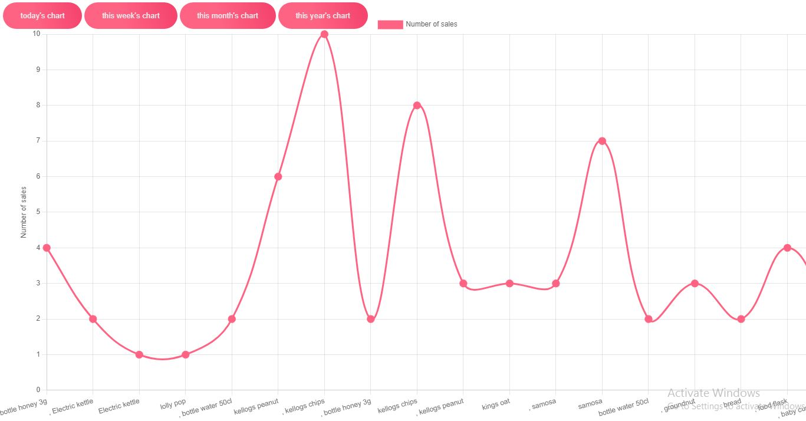

# POS Solution

## Overview

This POS web software solution offers a comprehensive system for managing sales and inventory for businesses. It includes functionalities for both administrators and cashiers to streamline the sales process and manage inventory efficiently. 



## Technologies

- Html5 
- Scss(sassy css)
- Javascript
- Ajax
- Npm
- Chart.js
- Fpdf
- Php
- Mysql

## Features

- **Admin and Cashier Login and Logout**: Secure access for administrators and cashiers.
- **Receipt Generation**: Automatically generate receipts after sales transactions.
- **Sales Reports**: 
    - View real time sales charts (daily, weekly, monthly,  yearly, and custom) and snapshots for an easy  overview of business performance.
    - Generate PDF and CSV files for sales reports.
    - View detailed sales reports including cashier information, sale time, items bought, and payment method.
- **Notes**: Add and store notes to the local storage of the browser.
- **Distributor Management**: Admin can add or remove distributors.
- **Cashier Management**: Admin can add or remove cashiers from the system.
- **Settings**:
    - Adjust system settings such as resetting expiry countdown and product out-of-stock threshold.
    - Updating of admin login details.

- **Notifications**:
   - Admin can get real time notifications on products out of stock base on the threshold set or products close to expiry base on the countdown set.
    
- **UDO (unsold,destroyed,other) list**:
   - Admin can remove any product along with its quantity if it is destroyed, unsold, internally used, or for other reasons.
     
 - **Product restocking**:
   - When a product is out of stock, it can be restocked efficiently.

- **Updating of sales price**:
   - In situations where sales prices or tax values need to be updated, you can easily do so with a click.

## Shell

To clone the repository and get started with the project, use the following shell commands:

```shell
git clone https://github.com/Emm-Anuel100/Point-of-sale-system.git
```

```shell
cd Point-of-sale-system
```

## License

This project is licensed under the [MIT License](./LICENSE). You can find the license file in the `LICENSE` file in this repository.
